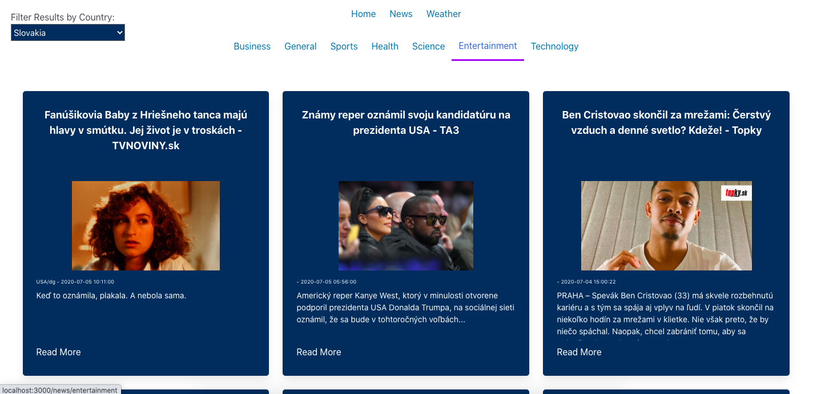
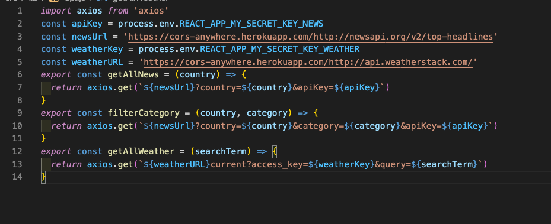
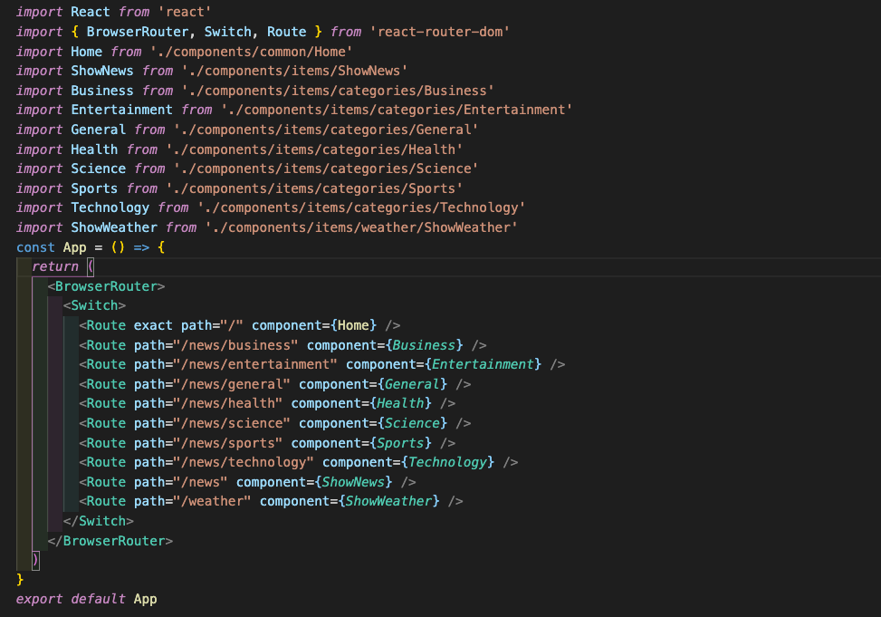
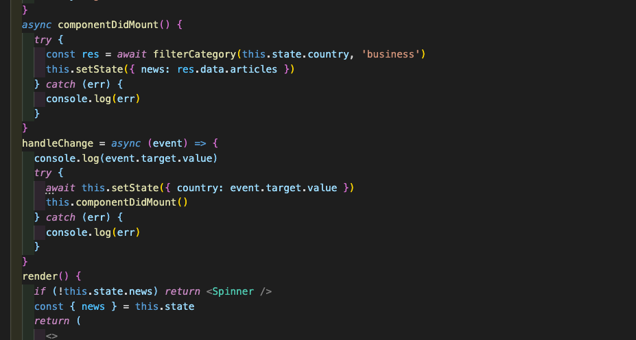
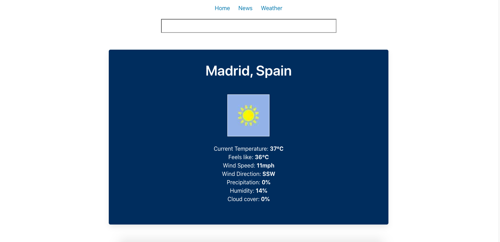

# ** SEI Project two: News and Weather**

## https://news-worldwide-ykbhrn.netlify.app/

## **Overview.**

Project 2 was my first experience of pair coding. My partner and I had to create a front end app using **React** and **Axios** to consume an **API** in just over 1 day. We made the decision to build a News and Weather app with 2 seperate APIs both had rich resources. 

Once built our app was deployed using **Netlify**

-------------------------

## **Brief.**

Use at least one public API into a React application to create a fun or useful product.

-------------------------

## **Technologies used.**

#### Front End:
* **React**
* **Axios**
* Bulma
* SCSS
* React loader spinner
* React router dom

#### Dev Tools:

* Yarn
* VScode 
* Insomnia
* Git
* Github
* Google Chrome dev tools
* Eslint
* Netlify

-------------------------

## **Approach.**

#### APIs:

For our app we decided to use 2 seperate **APIs** to give a more well rounded experience. For both we followed the **documentation** on the *API's* website. We used **Yarn** to install the **Axios** dependency to use our request and return responses in *JSON* rather than using fetch then having to convert to JSON. The structure of the *APIs* required us to pass arguments to our Axios requests to enable specific queries.

#### Components and general structure:

##### News:

The structure of the app was created using **React**. We used the *Browser Router, Switch and Route* from the **React-router-dom** package to lay out navigation paths for the app. I created a main Nav bar and a sub-Navbar, available only under the news heading on the main nav bar. We also decided to exclude navbar and footer from the home page meaning we had to import it, when necessary, rather than putting it in the App.js before the *switch and routes*

We used our sub-navbar to build on our main headlines page and use the **NewsAPI**'s ability to take specific categories and add complexity to our app. 

In addition to specific news categories the **API** also offered a range of news in different countries (and languages). I used a *select* to make a drop down to offer news from around the world. I then used **React's** *onChange* event handler to set the state then pass the user's selected value to the *Axios* request. This enabled our app to display, for example, the *Entertainment news* in *Slovakia* (as seen below).

#### Weather:

We followed a very similar journey setting up our **Weather section**. We used *event listeners* to wait for the user to input their City/Town. **onSubmit** we passed the City to the *Axios* request then set state with the response. Once the state was set we were able to select the data we wanted to display from the *API*. 

Unfortunately, the free version of the *API* only allowed us to display the current weather and not future weather. This was disappointing but we made the most of the resources we were provided with. 

#### Design

We made the decision to make the style minimalistic across the app. We used **Bulma** for our initial lay out. However, once we had all functionality working we deviated from *Bulma* and used **SCSS** to adapt our design. *Keyframes* were used to animate the home page. 

-------------------------

## **Wins and Challenges.**

#### Wins:

Biggest win from the project was working in pair with my partner Ed. Our cooperation was very smooth, we were very effective and I enjoyed the process.

#### Challenges:

As we didn't have a lot of experiences with external APIs, our biggest challenge was finding the right api, learn how to use it and successfully implement it in the project.

------------------------