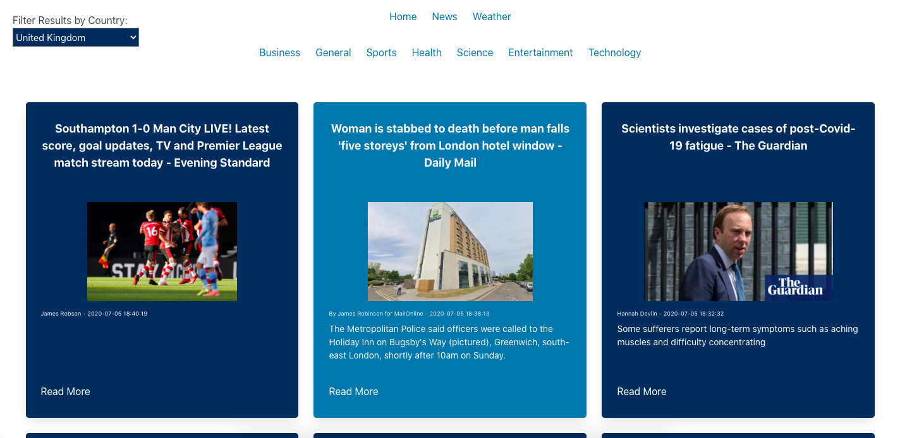

# ** SEI Project two: Reactathon**

## https://news-worldwide-ykbhrn.netlify.app/

## **Overview.**

Project 2 was my first experience of pair coding. My partner and I had to create a front end app using **React** and **Axios** to consume an **API** in just over 1 day. We made the decision to build a News and Weather app with 2 seperate APIs both had rich resources. 

Once built our app was deployed using **Netlify**

-------------------------